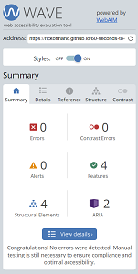

# 60-seconds-to-save-earth

[Link to Live Website](https://rickofmanc.github.io/60-seconds-to-save-earth/)

[GitHub Repo](https://github.com/RickofManc/60-seconds-to-save-earth)

***

## About

Slowing Climate Change requires a tremendous amount of global focus and effort if humanity is to prevent the Earth from prematurely burning up. One way to support this challenge is through education. A key cause of Climate Change is the dependency on burning fossil fuels, such as coal. I've created a game to raise awareness of this issue, aiming to make learning fun. The objective is to stop the building of more coal burning Power Stations with renewable energy, in the form of a Wind Turbine. 

***

## Index - Table of Contents

* [User Experience R&D](#user-experience-research-and-design)
    * [Strategy](#Strategy)
    * [Scope](#Scope)
    * [Structure](Structure)
    * [Skeleton](#Skeleton)
    * [Surface](#Surface)
* [Features](#Features)
* [Testing](#Testing)
* [Deployment](#Deployment)
* [Credits](#Credit)

***

## User Experience Research and Design

### Strategy

The game is targeted at a wide user base, starting from school children where concepts of the environment are first taught. The website should provide a clear message that continued use of fossil fuels has a negative impact on Earth's environment. To engage users, an arcade style will be adopted for the game as these are clear in terms of layout and centre around having fun. Using the classic game ['Whac-a-Mole'](https://en.wikipedia.org/wiki/Whac-A-Mole) as the platform, users will have '60 Seconds to Save Earth!' 

#### Leading User Stories

* As a user, I want to play a game that is easy to understand, challenging and fun to play, so I can be entertained
* As a user, I want to understand my score, so I can assess my progress 
* As a user, I want to understand how long I have to play the game, so I can meet the duration of the challenge
* As a user, I want to beat my score, so I can understand if I'm improving with the more I play
* As a user, I want to learn more about Climate Change, so I can understand more about the games theme and improve my own ways of living
*  As a user, I want to increase the difficulty, so that I can be more challenged if the default setting becomes too easy
* As a user, I want to exit the game at any point, so that I can change preferences or have to stop playing
* As a user, I want to turn off any music, sounds and effects, so I can play the game according to my personal preferences

#### Primary strategic aims for the website
* Educate on the impact of burning fossil fuels on Climate Change. 
* Create a game that can improve reaction times and hand-eye coordination.
* Make learning fun!

The roadmap below highlights the high-level strategic opportunities versus the importance and viability/feasibility of development for the MVP (Minimal Viable Product):

### Scope

An agile approach of keeping the in scope features simple and aligned to the strategy for the MVP will be adopted.
Below is a list of the leading features for the game.

#### In Scope Features
* An opening screen that clearly informs of the game scenario and what is required of the user.
* A button the user can click to initiate the start of the game when they are ready.
* In-game imagery to help convey the scenario
* In-game features that inform the user on;
    * the name of the game,
    * their score,
    * the time remaining to play,
    * when they score with an incremental score increase, screen flash, and sound clip.
* An alert to inform the user the game is over and their final score.
* The ability to 'Play Again'.
* The opportunity to learn more about the impact of burning fossil fuels on Climate Change.
* 404 error page to inform users they have navigated from the main content, or that there may be a bug with the website.

#### Out of Scope Features (for a future release)
* Allow users the ability to Pause and Resume whilst in-game
* Allow users to increase the game difficulty from the default 'Easy' to 'Hard'.
* In-game background music that can be toggled on/off either before or during the game.
* Differing images of fossil fuels being burnt.
* Animate the images when a hit is recorded.
* Countdown timer changes font colour when there is 10 seconds remaining.
* When there is 10 seconds remaining the in-game music quickens and a voice calls out the remaining time (10, 9, 8...).
* Share the user score with friends and other players on social media.
* Inform users how their score compares with others through an online leaderboard.

### Structure

This website will be structured with the following design considerations;
* The Information Architecture (IA) will follow a Hub and Spoke design, with the in-game page as the Hub, and pop-up screens as the spokes for the Game Intro and End Game screens.
* The Game Intro screen will introduce the user to the game scenario and the ability to start the game.
* This will open the in-game page complete with Header for score and time-left, and a footer for further information.
* After 60 seconds a customised Sweet Alert will appear to convey the end of the game.

### Skeleton

Key to this games accessibility to all generations is a clean design that whilst being simple in style and layout, allows the user to be instantly engaged and wanting to know more.

When the user clicks the 'Start Game' button the journey will continue through to the game screen, and the game will have commenced. The user should instinctively use the Wind Turbine icon to hit the Power Stations as they pop-up on the screen. 

Seeing their score increase will encourage the user to hit as many as possible during the remaining time. At the end of the game, the screen background will change from a fossil burning hot landscape, to one of green fields and renewable energy being used. This should evoke a happy user response for succeeding in the challenge. 

Excited from playing once, the user will presented with an option to 'Play Again' in an attempt to further save Earth and better their original score. The button will return the user back to the Start Game screen.

As part of this phase wireframes for all screens have produced using [Balsamiq](https://balsamiq.com/wireframes/) (see samples below - all wireframes can be found within the project [Repo](https://github.com/RickofManc/60-seconds-to-save-earth)).

The website is responsive through differing screen widths from with the final design requiring CSS Media Queries for max-screen widths of 650px and 405px, ensuring accessibility on any device or desktop monitor.

### Surface 

In consideration of the key aim to make learning fun, the visual language has to convey this tone. Therefore the use of arcade styles, known to be fun and engaging was applied in the following areas.

#### Colour 

The game of whac-a-mole released into Japanese arcade centres in the late 70's. As the 80's evolved, Neon colours became visible in arcade centres around the world and in the games themselves. To link the fun of this new game with those of the past, I have selected a neon based colour scheme. The palette was selected for free use from [Color Hunt](https://colorhunt.co/).

At a high-level the colour palette carries some of the games theme offering;
* A warning for the end of Earth scenario using Red and Orange hues,
* an opportunity to save Earth with Green renewable energy. This particular shade offers a colour that is bright to use for the most important elements of the site,
* and a neutral balance with calm Dark Blue that also balances the brighter colours.

#### Fonts

I have selected the free to use font 'Teko' from Google Fonts as the design has a low stroke contrast, square proportions and a structure that appears visually simple which aligns with the arcade style fonts of the 70's and 80's, whilst being more legible. According to the font information "Teko is an excellent choice for use in advertising or for news tickers on television screens (breaking news, etc.)". This style trait will help convey the scenario of an emergency where the user must act quickly, with speed being one of the main methods to achieve a high game score.

#### Images & Icons

To provide an arcade style to the game vector images and icons were used throughout the website.

The 'Power Station' icon used to represent fossil fuels was sourced free for commercial use through [Pixabay](https://pixabay.com/vectors/power-station-electricity-3664263/) with credit due to designer Jerzy Gorecki.

The 'Wind Turbine' icon used to hit back at the Power Stations was also sourced free for commercial use through [Pixabay](https://pixabay.com/vectors/wind-turbine-wind-renewable-energy-1894024/) with credit due to designer Laurence Ledanois.

The 'In-game' background vector is sourced from [Adobe Stock](https://stock.adobe.com/uk/images/drought-concept-desert-landscape-rocks-and-stone/318820031) and being used under the paid for Standard License.

The 'End Game' background vector was sourced free for commercial use from [Freepik](https://www.freepik.com/free-vector/wind-turbine-long-road-scene-dam-background_11250726.htm#&position=0&from_view=collections) with attribution due to the Designer brgfx.

The 'Favicon' has been sourced for free commercial use from [Raw Pixel](https://www.rawpixel.com/image/2904421/free-illustration-png-fire-planet-pollution).

The '404 Page' background vector is sourced from [Adobe Stock](https://stock.adobe.com/uk/Library/urn:aaid:sc:EU:817bd93c-48b0-4709-a9ae-459b0d2bb485?asset_id=437603661) and being used under the paid for Standard License.

***

## Features

### Universal Features

##### In-game
There are several in-game features that a user may expect to find when playing a game of this nature;
* A scoreboard which increments by 1 with every successful hit.
* A timer counting down how long is left on the users turn.
* There are sounds to enhance the playing experience in the form of a sound for swiping at the Power Stations, and a different sound when the user successfully stops a Power Station. Both sound effects are wave files created at [jsfxr](https://sfxr.me/).
* There is also a green screen flash for 50ms when a successful hit has been registered.

##### Meta data

To support the strategic aim 'Educate on the impact of burning fossil fuels on Climate Change', Meta data has been included within the website HTML head element to increase the traffic to this website. Furthermore the site page has been titled appropriately as another method of informing users of their location.

##### Redirection

A '404 Not Found' page has been added to the website in the event of a failed link or page. This page kindly informs the user of the error and provides a button to navigate them back to the Game Intro screen.

### Future Features

Following a successful MVP launch, the game has the opportunity to be further developed over a relatively short period to increase its reach globally. Here is a selection of the key future development features:
* Change difficulty between 'Easy' and 'Hard' to further challenge users.
* Differing images of fossil fuels being burnt to increase educational awareness.
* Different end-game screen if the user score is 0.
* Animate the images when a hit is recorded.
* Optional background music to enhance the user experience.
* To increase speed and focus, background music could quicken with 10 seconds remaining and a voice calls (10, 9, 8...).
* Share scores with friends and other players on social media.
* Inform users how their score compares with others through a online leaderboard.

***

## Testing 

Throughout the Build phase Chrome Developer Tools are used to ensure all pages are being developed to remain intuitive, responsive and accessible across all device widths. Primarily the pages were designed at 1920px wide reducing to 320px for mobile devices. These tools and others were used for the Testing phase. Full details and results of this phase can be found within the project [Repo](https://github.com/RickofManc/60-seconds-to-save-earth).

The following sections summarise the tests and results.

### Code 

The code on each file has been tested using the appropriate validation service; W3C Markup for HTML, W3C Jigsaw for CSS and JSHint for JavaScript.

Below are the summarised positive results from these tests:

* **index.html** - 0 Errors / 0 Warnings
* **404.html** - 0 Errors / 0 Warnings
* **style.css** - 0 Errors / 1 Warning 'Imported style sheet for Google Font has not been checked as part of the direct input validation service. This is a known and acceptable warning.
* **sweetalert2.css** - 0 Errors / 47 Warnings informing '-webkit-animation is a vendor extension'. This is anticipated and a accepted warning.
* **script.js** - 0 Errors / 24 Warnings considered acceptable consisting of either;
    1. 'const' is available in ES6 (use 'esversion: 6') or Mozilla JS extensions (use moz) or,
    2. 'arrow function syntax (=>)' is only available in ES6 (use 'esversion: 6').
* **sweetalert.js** - 0 Errors / 804 Warnings considered acceptable consisting of either;
    1. 'const' is available in ES6 (use 'esversion: 6') or Mozilla JS extensions (use moz) or,
    2. 'arrow function syntax (=>)' is only available in ES6 (use 'esversion: 6').

### Browser

To ensure site visitors can view and play the '60 Seconds to Save Earth Game' on differing browsers, testing was performed on the test scenarios listed in the table below.

To achieve a 'Pass' the following criteria had to be met across all website pages;
1. All buttons provide user feedback on hover and execute correctly when clicked.
2. All images are loaded and displayed correctly at the differing media queries.
3. All pages retain layout integrity throughout the Body and across the differing media queries
4. All text uses 'Teko' font style.
5. The external link activates when clicked, and opens in a new tab or browser window.
6. The game starts as planned with a countdown from 60 seconds, and users are able to score points.
7. All in-game sounds and flash effects work throughout the 60 seconds game time.
8. The end-game screen appears after 60 seconds and provides the user with their final score.
9. 404 Error Page could be found and users can navigate back to the homepage using the button provided.

| Browser                    | Version | Test Facility  | Pass | Partial Pass | Fail | Comments for Partial Pass and/or Fail                                          |
| -------------------------- | ------- | -------------- | ---- | ------------ | ---- | ------------------------------------------------------------------------------ |
| Internet Explorer          | 8       | Netrender.com  |      |              | :heavy_check_mark: | Website could not be rendered                                                  |
| Internet Explorer          | 9       | Netrender.com  |      |              | :heavy_check_mark: | Website could load the opening screen however no further functionality         |
| Internet Explorer          | 10      | Netrender.com  |      |              | :heavy_check_mark: | Website could not be rendered                                                  |
| Internet Explorer          | 11      | ASUS ZenBook   | :heavy_check_mark: |              |      | Website worked however IE11 is being phased out by Microsoft in June 2022      |
| Microsoft Edge (Win 11)    | 98      | ASUS ZenBook   | :heavy_check_mark: |              |      |                                                                                |
| Google Chrome (Win 11)     | 97      | ASUS ZenBook   | :heavy_check_mark: |              |      |                                                                                |
| Firefox                    | 96      | ASUS ZenBook   | :heavy_check_mark: |              |      |                                                                                |
| Safari (macOS Mojave)      | 12      | lambdatext.com | :heavy_check_mark: |              |      |                                                                                |
| Opera (macOS Sierra 10.12) | 74      | lambdatext.com | :heavy_check_mark: |              |      |                                                                                |

### Device

To ensure site visitors can view and play the '60 Seconds to Save Earth Game' on differing devices, testing was performed on the test scenarios listed in the table below.

To achieve a 'Pass' the following criteria had to be met across all website pages;
1. All buttons provide user feedback on hover and execute correctly when clicked.
2. All images are loaded and displayed correctly at the differing media queries.
3. All pages retain layout integrity throughout the Body and across the differing media queries
4. All text uses 'Teko' font style.
5. The external link activates when clicked, and opens in a new tab or browser window.
6. The game starts as planned with a countdown from 60 seconds, and users are able to score points.
7. All in-game sounds and flash effects work throughout the 60 seconds game time.
8. The end-game screen appears after 60 seconds and provides the user with their final score.
9. 404 Error Page could be found and users can navigate back to the homepage using the button provided.

| Device       | Type               | Pass | Partial Pass | Fail |
| ------------ | ------------------ | ---- | ------------ | ---- |
| Mobile Phone | iPhone SE          | :heavy_check_mark: |              |      |
| Mobile Phone | Samsung Galaxy S21 | :heavy_check_mark: |              |      |
| Tablet       | iPad (2020)        | :heavy_check_mark: |              |      |
| Tablet       | iPad 3 (2012)      | :heavy_check_mark: |              |      |
| Laptop       | ASUS ZenBook 14"   | :heavy_check_mark: |              |      |

### Accessibility 

Each page has been tested using the [Wave (Web Accessibility Evaluation Tool)](https://wave.webaim.org/) where zero errors or alerts were identified.

 

### Performance 

Using Lighthouse performance testing within Chrome Developer Tools, all pages performance has been tested on both Desktop and Mobile devices. The results highlighted a slightly slower page load time than is recommended. This was primarily due to the browser attempting to load the JavaScript files at the same time as the DOM and CSS. To resolve this issue the 'defer' attribute was applied in the HTMl Script tags informing the Browser to prioritise the more critical page elements before the JavaScript. This helped to improve the user experience, and see the following positive results.

### User Stories

The leading user stories have been tested to ensure the priority aims of the website have been delivered. 
Below is a summary of the stories validation.

* As a user, I want to play a game that is easy to understand, challenging and fun to play, so I can be entertained
    * The concept of whac-a-mole has been hugely popular for decades and this came across in user testing with the vast majority liking and understanding the game from their first play.
* As a user, I want to understand my score, so I can assess my progress
    * The in-game scoreboard increments by 1 point as the user successfully hits a Power Station.
* As a user, I want to understand how long I have to play the game, so I can meet the duration of the challenge
    * There is an in-game countdown timer that provides 60 seconds to the user to hit as many Power Stations as they can within the time.
* As a user, I want to beat my score, so I can understand if I'm improving with each turn
    * At the end of the game the user is informed of their final score and provided with a button to 'Play Again' which navigates them back to the opening screen. A future feature will store the score on a database so a user can see progress over several plays, and also see other users scores.
* As a user, I want to learn more about Climate Change, so I can understand more about the games theme and improve my own ways of living
    * The opening page provides an opportunity to learn more about Climate Change through clicking a button on the opening screen. This opens a new browser tab/window to an article on the impacts of burning fossil fuels on the Earths climate.
* As a user, I want to increase the difficulty, so that I can be more challenged if the default setting becomes too easy
    * This user story is scheduled to be developed in a future release with a button available to the user on the opening screen that allows them to toggle between Easy and Hard. A boolean function will be added to the existing JavaScript code to increase the speed of the Power Station popping-up if the user has selected 'Hard'. This will translate as the false option within the function.
* As a user, I want to exit the game at any point, so that I can change preferences or have to stop playing
    * An in-game feature is being developed that will be located within the Header. This will allow the user to click at any point during the 60 seconds to return back to the opening screen.
* As a user, I want to turn off any music, sounds and effects, so I can play the game according to my personal preferences
    * A feature is being developed that will allow the user the opportunity to toggle these aspects on or off from either the opening screen or in-game. Due to time constraints this may be scheduled in a future release.

### Issues

The issues listed in the table below we identified during late January / early February 2022. Some issues remain with fixes required for future releases.
Where indicated the issue has either been resolved or no further action will be taken at the present time.

| Ref  | Title                                            | Description                                                                                                   | Issue location | Code       | Date Identified | Date Resolved | Latest Update                                                                                                                                                                                                                            |
| ---- | ------------------------------------------------ | ------------------------------------------------------------------------------------------------------------- | -------------- | ---------- | --------------- | ------------- | ---------------------------------------------------------------------------------------------------------------------------------------------------------------------------------------------------------------------------------------- |
| ISS1 | Opening screen not covering screen               | The modal that greets users to the site is not completely covering the main in-game content behind            | Modal Div.     | CSS        | 31/01/2022      | 01/02/2022    | Added 'Top : 0' to CSS styles and ensured the Height and Margin properties were applied correctly.                                                                                                                                       |
| ISS2 | High Score font not using theme                  | The text within the Header element is not showing the applied CSS styles                                      | In-game Div.   | CSS        | 31/01/2022      | 01/02/2022    | Changes were required to the CSS styles to override the browser attributes for H1 and H2 elements to ensure the look and feel of the website was consistent for users.                                                                   |
| ISS3 | Users final score not showing on End Game screen | The final result displayed on the pop-up message is 0                                                         | Script.js      | JavaScript | 31/01/2022      | 01/02/2022    | The data the code was referencing was incorrect and required a change within the Sweet Alert function to show the 'result'.                                                                                                              |
| ISS4 | Slow page loading time                           | Lighthouse testing highlighted the initial page loading could be more inline with user expectations           | HTML script  | HTML       | 07/02/2022      | 07/02/2022    | Following the guidance provided by Lighthouse, the 'defer' attribute was added to both Script tags within the index.html file to delay the loading of JavaScript. This allowed the more critical elements to be prioritised for loading. |
| ISS5 | Content small on 5K screens                      | Users who are playing the game on a 5K screen would not be able to see the content clearly as it is too small | Stylesheet     | CSS        | 07/02/2022      |               | Media queries being developed to ensure the game is playable on the largest screens. This fix will likely be scheduled for the next release.                                                                                             |

## Deployment

This project was deployed using the steps below with version releasing active. Please do not make any changes to files within this repository as any changes pushed to the main branch will be automatically reflected on the live website. Instead please follow the second set of steps which guide you to forking and cloning the website where changes can be made without impact to the live website. Thanks!

1. Logged into [my GitHub repository](https://github.com/RickofManc/60-seconds-to-save-earth)
1. Clicked on the "Settings" button in the main Repository menu.
1. Clicked "Pages" from the left hand side navigation menu.
1. Within the Source section, clicked the "Branch" button and changed from 'None' to 'Main' in the dropdown menu.
1. The page automatically refreshed with a url displayed.
1. Tested the link by clicking on the url.

The live website can be found here https://rickofmanc.github.io/60-seconds-to-save-earth/

To fork this website to either propose changes or to use as an idea for another website, follow these steps:
1. If you haven't yet, you should first set up Git. Don't forget to set up authentication to GitHub.com from Git as well.
1. Navigate to the [60 Seconds to Save Earth repository](https://github.com/RickofManc/60-seconds-to-save-earth).
1. Click the 'Fork' button on the upper right part fo the page. It's in between 'Watch' and 'Star'.
1. You will now have a fork of the 60 Seconds to Save Earth repository added to your GitHub profile. Navigate to your own profile and find the forked repository to add the required files.
1. Above the list of forked files click the 'Code' button.
1. A drop-down menu will appear providing a choice of cloning options. Select the one which is applicable to your setup.
Further details on completing the final step can be found on GitHub's ['Fork a Repo'](https://docs.github.com/en/get-started/quickstart/fork-a-repo) page.

***

## Credit

### People

* Mentor Brian Macharia for guiding and advising throughout the projects lifecycle.
* Code Institute Slack community for peer reviewing the code.

### Software & Web Applications

* [Balsamiq](https://balsamiq.com/) - Used to build wireframes in the Skelton phase. 
* This website was coded using HTML, CCS and JavScript with [GitPod](https://gitpod.io/) used for an IDE and [GitHub](https://github.com/) as a hosting repository.
* [W3schools](https://www.w3schools.com/) - Source of 'How to...' information throughout the build.
* [MDN](https://developer.mozilla.org/en-US/) - Source of 'How to...' information on JavaScript and customising Sweet Alerts.
* [FreeConvert](https://www.freeconvert.com/) - For converting and compressing images to improve performance.
* [Wave](https://wave.webaim.org/) - Accessibility Testing to ensure content is readable for all users.
* [HTML Validator](https://validator.w3.org/) - For validating HMTL code.
* [CSS Validator](https://validator.w3.org/) - For validating CSS code.
* [JS Validator](https://jshint.com/)  - For validating JavaScript code.
* [Code Beautify](https://codebeautify.org/) - For validating the layout of all code.
* [IE NetREnderer](https://netrenderer.com/index.php) - For testing website functionality on IE versions 7-10.
* [LambdaTest](https://www.lambdatest.com/) - For cross browser testing on macOS versions of Safari and Opera.

### Code

* [Sweet Alerts](https://sweetalert.js.org/) - For being a beautiful replacement for a browser alert at the end of the game.
* YouTubers Ania Kubow [game-play] and Kod Aktif [effects] as sources of learning JavaScript code that has provided some of the game functionality.

### Inspiration

* A six year old whose future needs to be greener and favourite game at the arcades is Whac-a-Mole!

